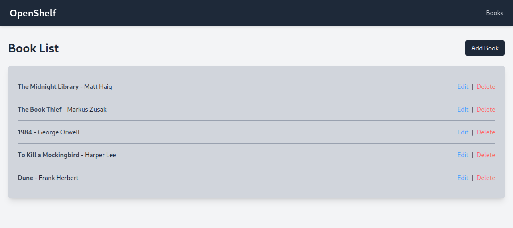

# Library App



## Features

1. Manage books (Create, Read, Update, Delete)
2. Manage book borrowing history (Borrows, Returns)

## Setup
1. Install dependencies

```sh
bundle install
```

2. Setup database

```sh
rails db:migrate
```

3. Run server

```sh
rails server
```

4. Run tests

```sh
rails test
```